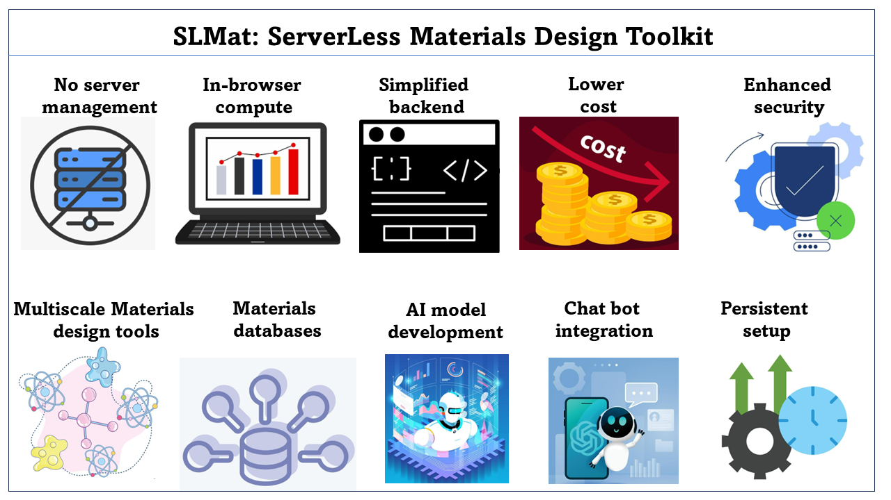
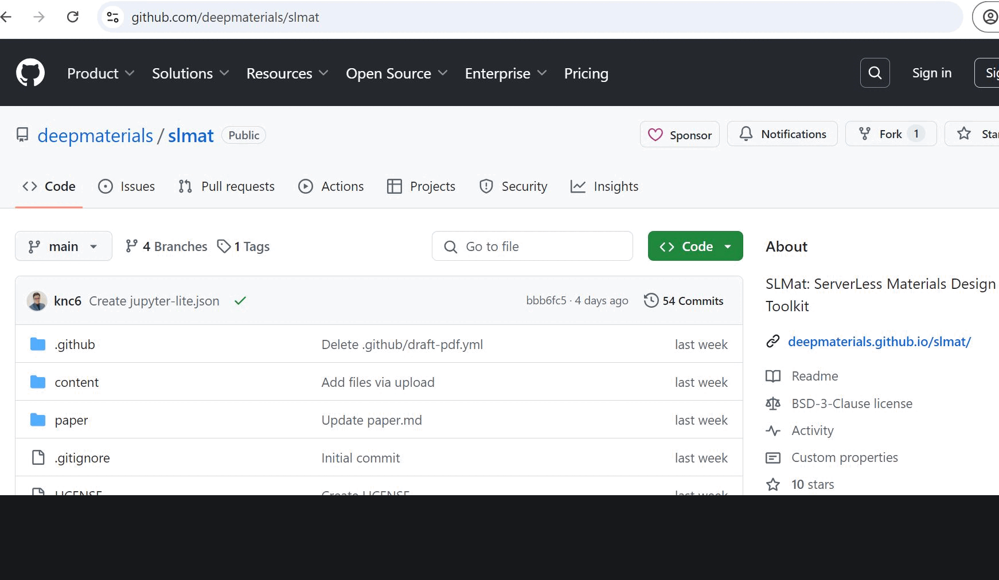

# SLMat: ServerLess Materials Design Toolkit

## Table of Contents
* [Introduction](#intro)
* [Examples](#example)
* [Notes](#notes)
* [Contribute $1/month](#contribute)
* [SLMat Pro](#SLMatPro)
* [Reference](#reference)
* [Contact](#contact)
  

## Introduction

SLMat is a serverless, browser-based toolkit that revolutionizes computational materials science by offering a scalable and efficient alternative to traditional server-based platforms like Google Colab. By eliminating the need for server management and providing persistent setups, SLMat enhances productivity and security, enabling researchers to focus on innovation rather than infrastructure. The toolkit integrates seamlessly with materials databases, supports AI model development, and offers advanced features like AI-guided coding and chatbot integration. With its streamlined workflow, SLMat accelerates production time, promotes reproducibility, and democratizes access to powerful computational resources. This makes SLMat an essential tool for modern materials science, offering a versatile and cost-effective solution for researchers across various domains.

Examples
---------

| Notebooks                                                                                                                                      | SLMat                                                                                                                                        | Descriptions                                                                                                                                                                                                                                                                                                                                                                                              |
| ---------------------------------------------------------------------------------------------------------------------------------------------- | -------------------------------------------------------------------------------------------------------------------------------------------------------- | --------------------------------------------------------------------------------------------------------------------------------------------------------------------------------------------------------------------------------------------------------------------------------------------------------------------------------------------------------------------------------------------------------- |
| [Visualizing atoms](https://github.com/deepmaterials/slmat/blob/main/content/Visualization.ipynb)                                                       | [![Open in SLMat]](https://deepmaterials.github.io/slmat/lab?fromURL=https://raw.githubusercontent.com/deepmaterials/slmat/main/content/Visualization.ipynb)                                 | Visualizing atomic structure of face-centered cubic Aluminum.                                                                                                                                                                                                                                                                       |
| [ASE Scaling Test](https://github.com/deepmaterials/slmat/blob/main/content/ASEScalingTest.ipynb)                                                       | [![Open in SLMat]](https://deepmaterials.github.io/slmat/lab?fromURL=https://raw.githubusercontent.com/deepmaterials/slmat/main/content/ASEScalingTest.ipynb)                                 | Examples for analyzing number of atoms vs time taken to simulate copper atoms using ASE and EMT.                                                                                                                                                                                                                                                                       |
| [ASE Ni MD](https://github.com/deepmaterials/slmat/blob/main/content/ASE_Ni_MD.ipynb)                                                  | [![Open in SLMat]](https://deepmaterials.github.io/slmat/lab?fromURL=https://raw.githubusercontent.com/deepmaterials/slmat/main/content/ASE_Ni_MD.ipynb)                            | Examples of running molecular dynamics calculations for Nickel.                                                                                                                                                                                                                                                                                                                                 |
| [DFT Database analysis](https://github.com/deepmaterials/slmat/blob/main/content/Database_analysis.ipynb)                                                  | [![Open in SLMat]](https://deepmaterials.github.io/slmat/lab?fromURL=https://raw.githubusercontent.com/deepmaterials/slmat/main/content/Database_analysis.ipynb)                            | Examples of loading and analyzing density functional theory databases such as Materials Project, JARVIS-DFT.                                                                                                                                                                                                                                                                                                                                 |
| [Interface generation](https://github.com/deepmaterials/slmat/blob/main/content/Interfaces.ipynb)                                                  | [![Open in SLMat]](https://deepmaterials.github.io/slmat/lab?fromURL=https://raw.githubusercontent.com/deepmaterials/slmat/main/content/Interfaces.ipynb)                            | Example of generating atomic structure interfaces.                                                                                                                                                                                                                                                                                                                                 |
| [FiPy dendritic solidification](https://github.com/deepmaterials/slmat/blob/main/content/FiPy.ipynb)                                                  | [![Open in SLMat]](https://deepmaterials.github.io/slmat/lab?fromURL=https://raw.githubusercontent.com/deepmaterials/slmat/main/content/FiPy.ipynb)                            | Examples of solving a dendritic solidification problem with FiPy.                                                                                                                                                                                                                                                                                                                                 |
| [Scikit-FEM Poisson problem](https://github.com/deepmaterials/slmat/blob/main/content/scikit-fem.ipynb)                                                  | [![Open in SLMat]](https://deepmaterials.github.io/slmat/lab?fromURL=https://raw.githubusercontent.com/deepmaterials/slmat/main/content/scikit-fem.ipynb)                            | Examples to solve the Poisson problem.                                                                                                                                                                                                                                                                                                                                 |
| [ML Sklearn Steel Fatigue](https://github.com/deepmaterials/slmat/blob/main/content/ML_Sklearn.ipynb)                                                  | [![Open in SLMat]](https://deepmaterials.github.io/slmat/lab?fromURL=https://raw.githubusercontent.com/deepmaterials/slmat/main/content/ML_Sklearn.ipynb)                            | Examples of training machine learning model for steel fatigue using scikit-learn.                                                                                                                                                                                                                                                                                                                                 |

[Open in SLMat]: https://img.shields.io/badge/Open-SLMat-blue

## Notes

1. If the demo takes longer to start, it maybe due to caching issue, try it in a private/in-cognito tab.
2. Unlike `pip install` in usual jupyterlab, SLMat uses `piplite`/`micropip` package as shown in the demos. Currently, only a few libraries are available with `micropip`.
3.  Any publicly available/hosted notebook can be launched with SLMat using `fromURL` function: [`https://deepmaterials.github.io/slmat/lab?fromURL=`](https://deepmaterials.github.io/slmat/lab?fromURL=), e.g., [`https://deepmaterials.github.io/slmat/lab?fromURL=https://raw.githubusercontent.com/knc6/jarvis-tools-notebooks/master/jarvis-tools-notebooks/Analyzing_data_in_the_JARVIS_DFT_dataset.ipynb`](https://deepmaterials.github.io/slmat/lab?fromURL=https://raw.githubusercontent.com/knc6/jarvis-tools-notebooks/master/jarvis-tools-notebooks/Analyzing_data_in_the_JARVIS_DFT_dataset.ipynb)
4.  Terminal access is under development.
5.  More detailed documentation development is still work in progress, feedback/suggestions are welcome using [GitHub issues](https://github.com/deepmaterials/slmat/issues/new)

## Contribute

If you like or support the DeepMaterials/SLMat project, please consider supporting our work:

| Amount | Payment Link |
|--------|--------------|
| $1     | [Link](https://buy.stripe.com/cN28zefKc6Nt2v65kk) |
| $10    | [Link](https://buy.stripe.com/4gw3eUdC40p5glW001) |
| $100   | [Link](https://buy.stripe.com/00gbLq8hK5JpfhS4gi) |

## Try SLMat Pro

Fill up this [Google form](https://forms.gle/FjrogZFJgTKKY8Y19)

 - Pro Features: Introduce advanced features for paid users, such as:

 - Advanced AI Tools: Access to more sophisticated AI-guided coding, model training, and premium algorithms.

 - Custom Integrations: Allow paid users to integrate SLMat with their private databases, in-house computing clusters, or custom APIs.

 - Faster Computation: Offer higher priority for computational resources, reducing wait times for simulations. 

 - Additional Storage: Provide additional cloud storage for datasets and models.

 - Extended Support: Include priority customer support, dedicated onboarding sessions, and exclusive tutorials.

## Reference
1. [SLMat: A Comprehensive Serverless Toolkit for Advanced Materials Design](https://doi.org/10.26434/chemrxiv-2024-fqq27)
2. Checkout DeepMaterials LLC website: [https://www.deepmaterials.org/](https://www.deepmaterials.org/)

## Contact

Email: [deepmaterialsllc@gmail.com](deepmaterialsllc@gmail.com)

    

